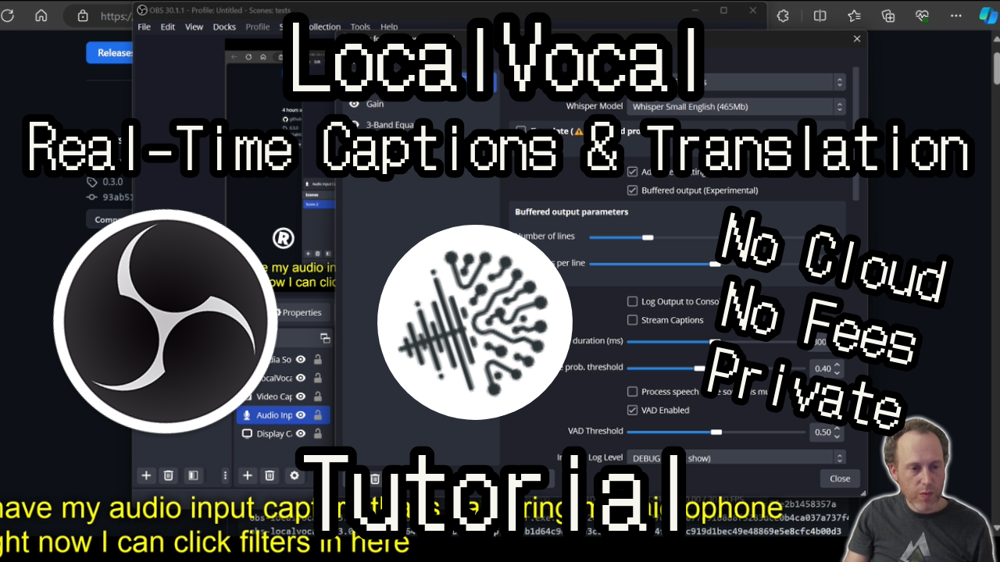

# LocalVocal - Speech AI assistant OBS Plugin

<div align="center">

[](https://github.com/occ-ai/obs-localvocal/blob/main/LICENSE)
[](https://github.com/occ-ai/obs-localvocal/actions/workflows/push.yaml)
[](https://github.com/occ-ai/obs-localvocal/releases)
[](https://github.com/occ-ai/obs-localvocal/releases)
[](https://discord.gg/KbjGU2vvUz)

</div>

## Introduction

LocalVocal lets you transcribe, locally on your machine, speech into text and simultaneously translate to any language. ✅ No GPU required, ✅ no cloud costs, ✅ no network and ✅ no downtime! Privacy first - all data stays on your machine.

If this free plugin has been valuable consider adding a ⭐ to this GH repo, rating it [on OBS](https://obsproject.com/forum/resources/localvocal-live-stream-ai-assistant.1769/), subscribing to [my YouTube channel](https://www.youtube.com/@royshilk) where I post updates, and supporting my work on [GitHub](https://github.com/sponsors/royshil), [Patreon](https://www.patreon.com/RoyShilkrot) or [OpenCollective](https://opencollective.com/occ-ai) 🙏

Internally the plugin is running [OpenAI's Whisper](https://github.com/openai/whisper) to process real-time the speech and predict a transcription.
It's using the [Whisper.cpp](https://github.com/ggerganov/whisper.cpp) project from [ggerganov](https://github.com/ggerganov) to run the Whisper network efficiently on CPUs and GPUs.
Translation is done with [CTranslate2](https://github.com/OpenNMT/CTranslate2).

## Usage

<p align="center">
  <a href="https://youtu.be/vHQ5HGvbRGQ" target="_blank">
    
  </a>&nbsp;
  <a href="https://youtu.be/4llyfNi9FGs" target="_blank">
    
  </a>
  <br/>
  <a href="https://youtu.be/vHQ5HGvbRGQ">https://youtu.be/vHQ5HGvbRGQ</a>
  <a href="https://youtu.be/4llyfNi9FGs">https://youtu.be/4llyfNi9FGs</a>
</p>

Do more with LocalVocal:
- [Translate Caption any Application](https://youtu.be/qen7NC8kbEQ)
- [Real-time Translation with DeepL](https://youtu.be/ryWBIEmVka4)
- [Real-time Translation with OpenAI](https://youtu.be/Q34LQsx-nlg)
- [ChatGPT + Text-to-speech](https://youtu.be/4BTmoKr0YMw)
- [POST Captions to YouTube](https://youtu.be/E7HKbO6CP_c)
- [Local LLM Real-time Translation](https://youtu.be/ZMNILPWDkDw)
- [Usage Tutorial](https://youtu.be/5XqTMqpui3Q)

Current Features:
- Transcribe audio to text in real time in 100 languages
- Display captions on screen using text sources
- Send captions to a .txt or .srt file (to read by external sources or video playback) with and without aggregation option
- Sync'ed captions with OBS recording timestamps
- Send captions on a RTMP stream to e.g. YouTube, Twitch
- Bring your own Whisper model (any GGML)
- Translate captions in real time to major languages (both Whisper built-in translation as well as NMT models)
- CUDA, hipBLAS (AMD ROCm), Apple Arm64, AVX & SSE acceleration support
- Filter out or replace any part of the produced captions
- Partial transcriptions for a streaming-captions experience

Roadmap:
- More robust built-in translation options
- Additional output options: .vtt, .ssa, .sub, etc.
- Speaker diarization (detecting speakers in a multi-person audio stream)

Check out our other plugins:
- [Background Removal](https://github.com/occ-ai/obs-backgroundremoval) removes background from webcam without a green screen.
- [Detect](https://github.com/occ-ai/obs-detect) will detect and track >80 types of objects in real-time inside OBS
- [CleanStream](https://github.com/occ-ai/obs-cleanstream) for real-time filler word (uh,um) and profanity removal from a live audio stream
- [URL/API Source](https://github.com/occ-ai/obs-urlsource) that allows fetching live data from an API and displaying it in OBS.
- [Squawk](https://github.com/occ-ai/obs-squawk) adds lifelike local text-to-speech capabilities built-in OBS

## Download
Check out the [latest releases](https://github.com/occ-ai/obs-localvocal/releases) for downloads and install instructions.

### Models
The plugin ships with the Tiny.en model, and will autonomously download other Whisper models through a dropdown.
There's also an option to select an external GGML Whisper model file if you have it on disk.

Get more models from https://ggml.ggerganov.com/ and [HuggingFace](https://huggingface.co/ggerganov/whisper.cpp/tree/main), follow [the instructions on whisper.cpp](https://github.com/ggerganov/whisper.cpp/tree/master/models) to create your own models or download others such as distilled models.

## Building

The plugin was built and tested on Mac OSX (Intel & Apple silicon), Windows (with and without Nvidia CUDA) and Linux.

Start by cloning this repo to a directory of your choice.

### Mac OSX

Using the CI pipeline scripts, locally you would just call the zsh script, which builds for the architecture specified in $MACOS_ARCH (either `x86_64` or `arm64`).

```sh
$ MACOS_ARCH="x86_64" ./.github/scripts/build-macos -c Release
```

#### Install
The above script should succeed and the plugin files (e.g. `obs-localvocal.plugin`) will reside in the `./release/Release` folder off of the root. Copy the `.plugin` file to the OBS directory e.g. `~/Library/Application Support/obs-studio/plugins`.

To get `.pkg` installer file, run for example
```sh
$ ./.github/scripts/package-macos -c Release
```
(Note that maybe the outputs will be in the `Release` folder and not the `install` folder like `pakage-macos` expects, so you will need to rename the folder from `build_x86_64/Release` to `build_x86_64/install`)

### Linux

#### Ubuntu

For successfully building on Ubuntu, first clone the repo, then from the repo directory:
```sh
$ sudo apt install -y libssl-dev
$ ./.github/scripts/build-linux
```

Copy the results to the standard OBS folders on Ubuntu
```sh
$ sudo cp -R release/RelWithDebInfo/lib/* /usr/lib/
$ sudo cp -R release/RelWithDebInfo/share/* /usr/share/
```
Note: The official [OBS plugins guide](https://obsproject.com/kb/plugins-guide) recommends adding plugins to the `~/.config/obs-studio/plugins` folder. This has to do with the way you *installed* OBS.

In case the above doesn't work, attempt to copy the files to the `~/.config` folder:
```sh
$ mkdir -p ~/.config/obs-studio/plugins/obs-localvocal/bin/64bit
$ cp -R release/RelWithDebInfo/lib/x86_64-linux-gnu/obs-plugins/* ~/.config/obs-studio/plugins/obs-localvocal/bin/64bit/
$ mkdir -p ~/.config/obs-studio/plugins/obs-localvocal/data
$ cp -R release/RelWithDebInfo/share/obs/obs-plugins/obs-localvocal/* ~/.config/obs-studio/plugins/obs-localvocal/data/
```

#### Other distros

For other distros where you can't use the CI build script, you can build the plugin as follows

1. Clone the repository and install these dependencies using your distribution's package manager:

    * libssl (with development headers)

2. Generate the CMake build scripts (adjust folders if necessary)

    ```sh
    cmake -B build-dir --preset linux-x86_64 -DUSE_SYSTEM_CURL=ON -DCMAKE_INSTALL_PREFIX=./output_dir
    ```

3. Build the plugin and copy the files to the output directory

    ```sh
    cmake --build build-dir --target install
    ```

4. Copy plugin to OBS plugins folder

    ```sh
    mkdir -p ~/.config/obs-studio/plugins/bin/64bit
    cp -R ./output_dir/lib/obs-plugins/* ~/.config/obs-studio/plugins/bin/64bit/
    ```

    > N.B. Depending on your system, the plugin might be in `./output_dir/lib64/obs-plugins` instead.

5. Copy plugin data to OBS plugins folder - Possibly only needed on first install

    ```sh
    mkdir -p ~/.config/obs-studio/plugins/data
    cp -R ./output_dir/share/obs/obs-plugins/obs-localvocal/* ~/.config/obs-studio/plugins/data/
    ```

### Windows

Use the CI scripts again, for example:

```powershell
> .github/scripts/Build-Windows.ps1 -Configuration Release
```

The build should exist in the `./release` folder off the root. You can manually install the files in the OBS directory.

```powershell
> Copy-Item -Recurse -Force "release\Release\*" -Destination "C:\Program Files\obs-studio\"
```

#### Building with CUDA support on Windows

LocalVocal will now build with CUDA support automatically through a prebuilt binary of Whisper.cpp from https://github.com/occ-ai/occ-ai-dep-whispercpp. The CMake scripts will download all necessary files.

To build with cuda add `ACCELERATION` as an environment variable (with `cpu`, `hipblas`, or `cuda`) and build regularly

```powershell
> $env:ACCELERATION="cuda"
> .github/scripts/Build-Windows.ps1 -Configuration Release
```


<picture>
  <source media="(prefers-color-scheme: dark)" srcset="https://api.star-history.com/svg?repos=occ-ai/obs-localvocal&type=Date&theme=dark" />
  <source media="(prefers-color-scheme: light)" srcset="https://api.star-history.com/svg?repos=occ-ai/obs-localvocal&type=Date" />
  
</picture>
